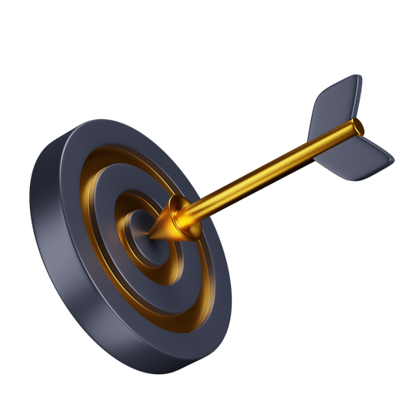

 
 &nbsp;   

✨ Hanzla Baig

💎 Frontend Developer | Founder of AquaScript

> Crafting the architecture of imagination — transforming pixels into stories and code into rhythm.

    

## 🚀 About Me 

 

Hi there 👋, I’m Hanzla Baig — a Frontend Developer, UI Engineer, and Product Creator who believes in merging artistic vision with engineering excellence.
I thrive on building immersive, performance-optimized interfaces and intuitive digital systems that elevate user experience.

 💭 Vision: Create open ecosystems that help developers build faster, smarter, and more beautifully. 

  🔥 Focus: Building frameworks, micro-libraries, and animated UI systems that spark creativity.

## 🧠 The Tech Universe I Command

> A dynamic arsenal of technologies that bridge creativity and logic.

  

##  Core Expertise

Frontend Engineering (React, Next.js, Vue, Angular, Svelte)

Web Animation & 3D Interfaces (GSAP, Framer Motion, Three.js)

UI/UX Design Systems & Architecture

API Integrations, WebSockets, Realtime Systems

AI-powered Chat Interfaces & Developer Tools

Cross-Platform Web App Development (PWA, SPA)

Open Source Frameworks & Developer Ecosystems

Performance Optimization & SEO Engineering

## 🏗️ Signature Projects

<table align="center">
<tr>
<td width="50%" align="center">🚀 Aquascript

> Developer tools for creative coders — scripts, APIs & automation.

</td>
<td width="50%" align="center">⚡ LuminaraJS

> Lightning-fast JS framework for animations & UI flow.

</td>
</tr>
<tr>
<td width="50%" align="center">🌐 TheBitForge

> A collaborative innovation lab for next-gen developers.

</td>
<td width="50%" align="center">🎨 Classic-CSS

> Minimalist yet powerful CSS framework for timeless design.

</td>
</tr>
</table>

## ✉️ Connect With Me

 

## 🌠 Philosophy

> The future belongs to those who code it beautifully.

✨ “Code isn’t just syntax — it’s sculpture in motion.”

⚡ TheBitForge

Crafting Digital Experiences That Redefine Innovation ⚙️

> "Forging creativity with technology — building the future, one pixel and algorithm at a time."

## 🚀 Who We Are

TheBitForge is a multidisciplinary digital agency built on innovation, precision, and creativity.
We help brands, startups, and enterprises transform their digital presence through design-driven engineering, cutting-edge AI, and strategic marketing.

> From web development to AI-driven campaigns — we build the future you imagine.

## 💼 Our Core Services

Service	Description

🌐 Website Development	Building fast, scalable, and elegant websites using modern frameworks and clean UI/UX principles.

🧠 AI / Machine Learning	Automating insights, workflows, and intelligent systems with advanced AI models and ML pipelines.

📈 Google & Meta Ads	Driving ROI-focused ad campaigns with deep analytics, creative copy, and precise targeting.

🎨 Graphic Design	Designing brand visuals, product mockups, and digital assets that communicate identity with impact.

⚙️ Custom Tools & Automation	Building tailored systems to optimize operations, integrate APIs, and accelerate growth.

🔍 SEO & Analytics	Enhancing brand visibility through smart optimization and strategic performance tracking.

## 🧰 Tech Stack & Tools

> We forge with the strongest tools of the trade.

## 🌐 Project Highlights

Project	Type	Description

AquaScript	Developer Tools	Modern developer utilities & productivity tools.
NeuraAI ChatBots	AI/ML	Smart conversational agents powered by deep learning.
Classic-CSS	Frontend Framework	A lightweight, modern CSS toolkit.
TheBitForge Portfolio	Agency Site	Dynamic digital portfolio built for performance.

## 🤝 Connect With Us

"The Future Isn’t Found — It’s Forged."

[ Join the CoderLegion Community](https://coderlegion.com/user/Hanzla+Baig+Dev)
